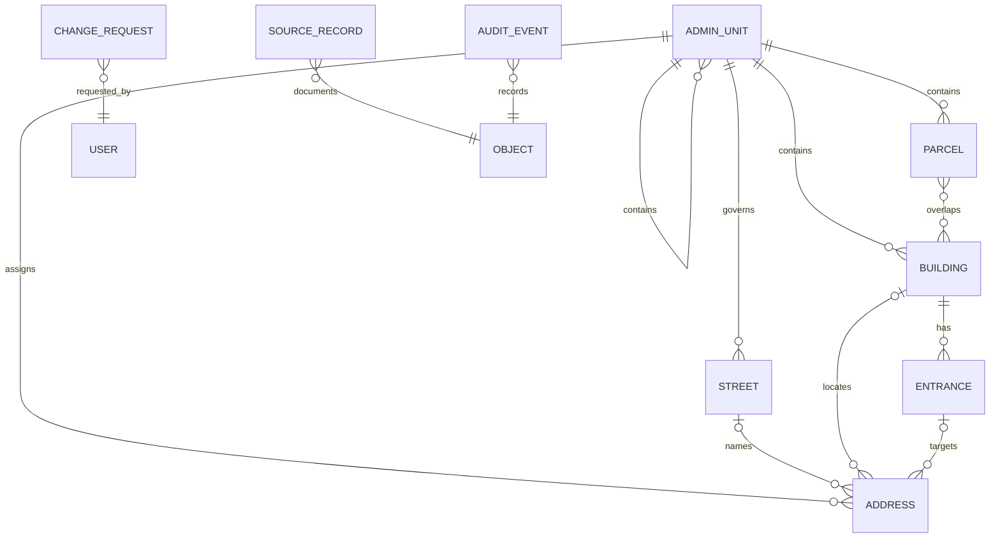

# Datenmodell und ERD

Adress-ID, Gebäude-ID und Grundstücks-ID sind niemals austauschbar. Lesbare Kennungen wie `SY-DI-MD-ADR-000001` helfen im Betrieb, während UUIDs die unveränderliche technische Identität bilden. Kennungsteile dürfen keine geheimen oder personenbezogenen Informationen kodieren.

Das SQL-Modell liegt in `db/migrations`. PostGIS nutzt WGS 84 (`EPSG:4326`) für Austausch und Speicherung im Pilot. Für amtliche Vermessung muss Syrien ein geeignetes nationales Referenzsystem und Transformationsregeln verbindlich wählen.
